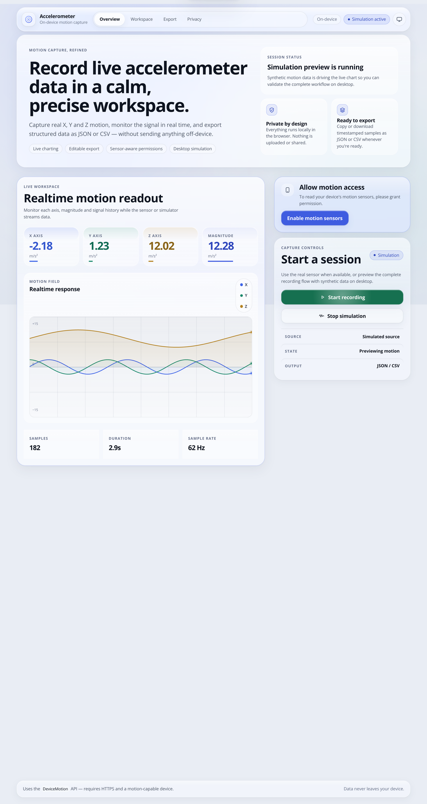

# Accelerometer

A lightweight, dependency-free web app for **recording your device's accelerometer data** and **exporting it** as JSON or CSV, so you can use it for simulation, analysis, prototyping, machine-learning datasets, or anywhere else you need real motion readings.

> **No tracking. No servers. No dependencies.** Your sensor data never leaves your device — everything runs client-side in the browser.



**Live demo:** [https://ketandutt.github.io/Accelerometer/](https://ketandutt.github.io/Accelerometer/)

---

## Features

- 📱 **Reads the real accelerometer** via the native `DeviceMotion` API on any motion-capable device.
- 🧊 **Liquid Glass interface** — a tokenised material system with depth, translucency and calm motion, in light *and* dark themes.
- 🧭 **3-axis readout** (X, Y, Z) plus the **magnitude** (|g|), live-updating.
- 📈 **Real-time chart** of X, Y and Z over time, drawn with a dependency-free `<canvas>` renderer.
- ⏺ **Record / stop / clear** with live stats: sample count, duration, and sample rate (Hz).
- 🎚 **Simulated data** so you can try the whole app on desktop/laptop browsers that have no accelerometer.
- 📤 **Export** the recorded data as **JSON** or **CSV** (comma-separated with header row), or **copy** it to the clipboard.
- ✏️ **Edit & re-export** — the exported data appears in an editable textarea, so you can trim, transform, or manually craft data and re-export it.
- 🛰 **Permission flow** — requests iOS 13+ / modern-Android motion permission properly, with graceful fallbacks and clear error messages.
- 🌗 **Appearance control** — Auto / Light / Dark plus a **Reduce motion** switch, both remembered between visits.
- 📊 **Inspectable chart** — hover or use the keyboard to read exact values at any sample, and toggle X/Y/Z series.
- ♿ **Accessible, responsive UI** built with semantic HTML, ARIA labels, visible focus, WCAG-checked contrast and `prefers-reduced-motion` / `prefers-reduced-transparency` support.

## Quick start

1. Open the site on a phone/tablet (motion-capable).
2. Grant permission when prompted (iOS shows a **"Enable motion sensors"** button).
3. Click **Start recording**, move your device, then click **Stop recording**.
4. **Copy**, **Download JSON**, or **Download CSV**.
5. On a desktop, click **Simulate data** to see the full flow without a sensor.
6. Hover (or arrow-key) across the chart to inspect individual samples; use the
   appearance button in the header to switch theme or reduce motion.

That's it — no build step, no install, no server.

## Data format

Each recorded sample is an object:

```json
{
  "t": 120.4,     // milliseconds since recording started
  "x": 0.12,      // acceleration along X, in m/s² (including gravity)
  "y": -0.03,     // acceleration along Y, in m/s²
  "z": 9.81,      // acceleration along Z, in m/s²
  "mag": 9.81     // magnitude = sqrt(x² + y² + z²)
}
```

The full export is a JSON **array** of such samples. CSV exports include a header row: `time,x,y,z,magnitude`. See [docs/DATA_FORMAT.md](docs/DATA_FORMAT.md) for details.

## Documentation

| Document | Description |
| --- | --- |
| [docs/README.md](docs/README.md) | Overview and documentation index |
| [docs/USAGE.md](docs/USAGE.md) | End-user guide |
| [docs/DEVELOPMENT.md](docs/DEVELOPMENT.md) | Developer & contribution guide |
| [docs/DATA_FORMAT.md](docs/DATA_FORMAT.md) | Data schema and file format |
| [docs/DESIGN.md](docs/DESIGN.md) | Design system: materials, tokens, motion, accessibility |
| [docs/CHANGELOG.md](docs/CHANGELOG.md) | Version history & migration notes |

## Project structure

```
Accelerometer/
├── index.html          # Markup, icon sprite and ambient background
├── css/
│   ├── tokens.css      # Design tokens (colours, materials, motion, layers)
│   ├── base.css        # Reset, ambient background, typography, focus
│   ├── components.css  # Glass materials and every component
│   ├── layout.css      # Page structure, appbar, dock, responsive rules
│   └── motion.css      # Keyframes, reveals, preference media queries
├── js/
│   ├── ui.js           # Presentation layer (theme, menus, dialogs, reveals)
│   └── app.js          # Application logic (sensor, chart, recording, export)
├── assets/
│   └── screenshot.png  # README preview screenshot
├── docs/               # Documentation
├── LICENSE             # MIT
└── README.md
```

See [docs/DESIGN.md](docs/DESIGN.md) for how the design system is put together.

## Browser support

- ✅ **Mobile browsers** (iOS Safari 13+, Android Chrome/Firefox) — full features.
- ⚠️ **Desktop browsers** — show the "simulate data" fallback unless the device exposes motion (some laptops do).
- Requires **HTTPS** for the `DeviceMotion` API to be available on non-localhost origins.

See [docs/DEVELOPMENT.md](docs/DEVELOPMENT.md) for the permission matrix and testing notes.

## License

Released under the [MIT License](LICENSE). Copyright © 2020 Ketan Dutt.
